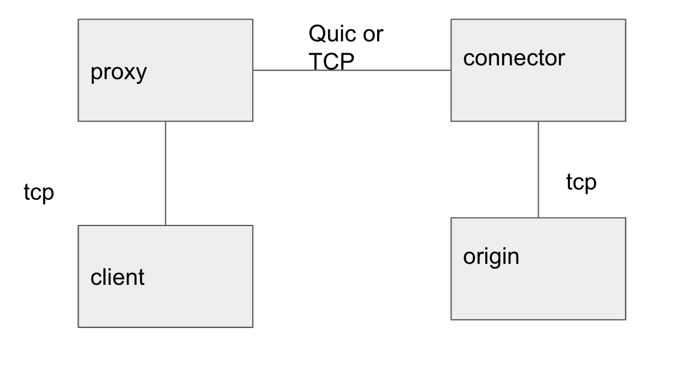
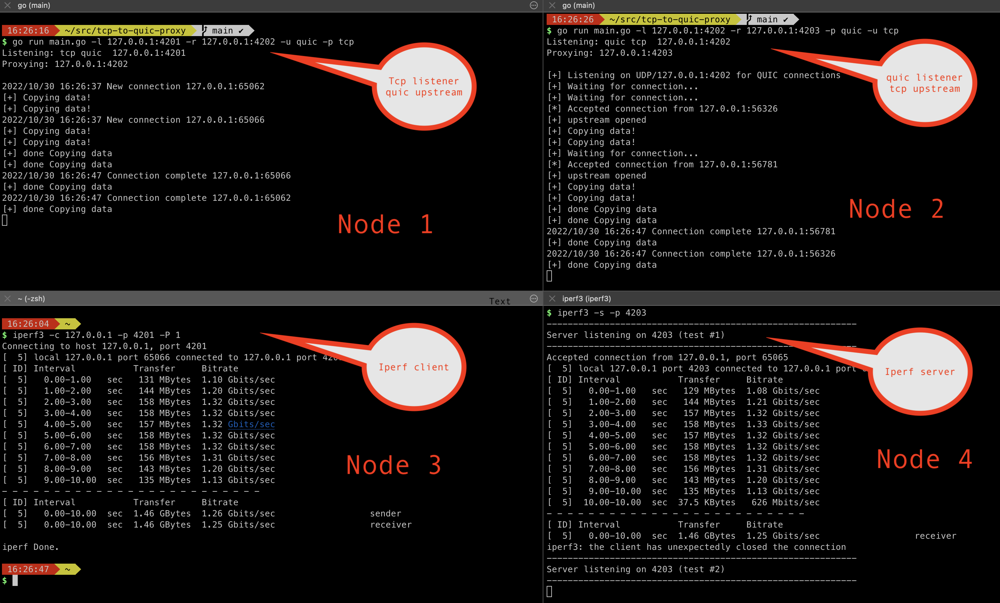

# tcp-to-quic-proxy
Quic to TCP proxy and vice versa. Mostlt to explore the Quic Go library

In this example we have 4 nodes, as the diagram below.  These are the nodes:
1) a TCP listener, that proxies to an upstream Quic server
2) a Quic listener, that proxies to an upstream TCP server
3) an Iper3 client (tcp)
3) an Iper3 server (tcp)




Node 1 is started like this
```
go run main.go -l 127.0.0.1:4201 -r 127.0.0.1:4202 -u quic -p tcp
```
Means it's listening on protocol TCP 127.0.0.1:4201, and connects to 127.0.0.1:4202 as an upstream server. The Upstream protocol is Quic

Node 2 is started like this
```
 go run main.go -l 127.0.0.1:4202 -r 127.0.0.1:4203 -p quic -u tcp
 ```
Means it's listening on protocol Quic 127.0.0.1:4202, and connects to 127.0.0.1:4203 as an upstream server. The Upstream protocol is TCP

Node 3 is the Iperf client, which connects to the node1 (traffic will be send upstream)
```
iperf3 -c 127.0.0.1 -p 4201 -P 1
```

Node 4 is the Iperf Server.
```
iperf3 -c 127.0.0.1 -p 4201 -P 1
```

# Results
Using the -u and -p flag you can control the protocol between node 1 and node 2 (either tcp or quick).
testing on my laptop I see quite a big difference between TCP and Quic
Quic performance: ~ 1.25 Gbits/sec
TCP performance: ~ 18.3 Gbits/sec

Maybe related to TCP TSO?



